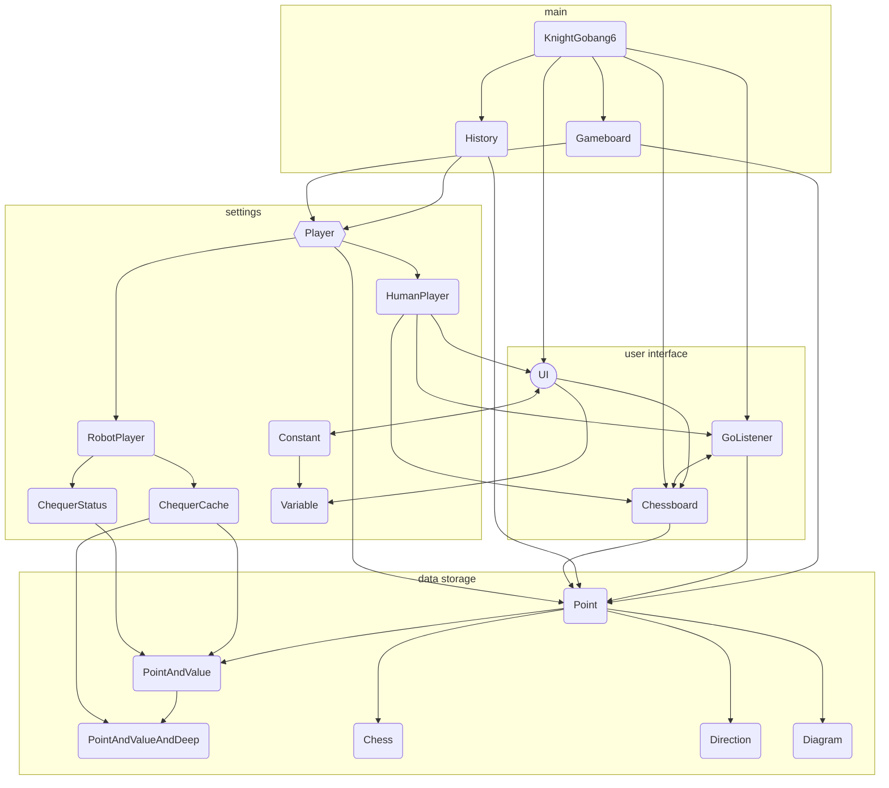

*It's my first time to creating software, please pardon me.*

Author: Ego-Echo

Date: April 30, 2024

## Introduction of the Software

The software provides a codified environment to play Knight Gobang 6.

## Installation Environment of the Software

- java environment

## Usage Instruction of the Software

The code entrance is in <code>KnightGobang6</code> class.

## Explanation of the Code Directory Structure

My code is literally flat, indicating that there is no other folder in the folder <code>src</code>.

Hope this can help you if you decide to have a look at the code.

## Explanation of common problems

This software has still many problems:

- When a retraction happens after a match is started, it might be trapped in a deadlock. I guess it's thread problem but I haven't solve it yet.

- When the user is challenging for the highest difficulty with a robotplayer, or just watching two robotplayers' battle, it might take a long time to calculate a single step. I have tried to reduce the point that a robotplayer has to evaluate, but it will make robotplayer's answer less accurate.

- The level of the robotplayer seems not too high. However, in my code I added minimax, Alpha-Beta pruning, heuristic algorithm, zobrist and cache, and I tried many times but failed.

I wish someone can solve these.

Moreover, there are still some function that have not finished:

- **A display picture.** In the display panel, there should be a display picture for explaining the second rule of the game with two example of "It permits a move there" and "It does not permit a move there".

- **Recording module.** In my original design, it can record at most 8 matches. When the user exit the software, the current match can be chosen to be saved or not. And the next time the user opens the software, there will be saved matches to continue.

- **Status bar.** In my original design, there is a status bar, which can display the real time status, including who's in turn at present, where is the last chess piece placed, it's a PVE or a PVP match and so on.

- **Background music.** Actually the background music is cancelled only because *TheY* has no time to make it. If I continue to improve the software in the future, there might be a background music in the game.

## More

If you want to know more about the software, or about the author, you can go to [Bilibili](https://space.bilibili.com/503109878) and find me. Welcome to your arrival.

And, if there is someone who solves all the problems and adds all the unfinished functions, please let me know.
